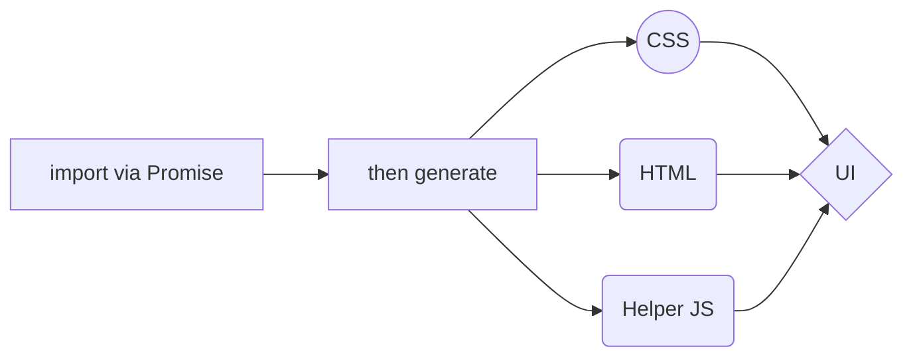
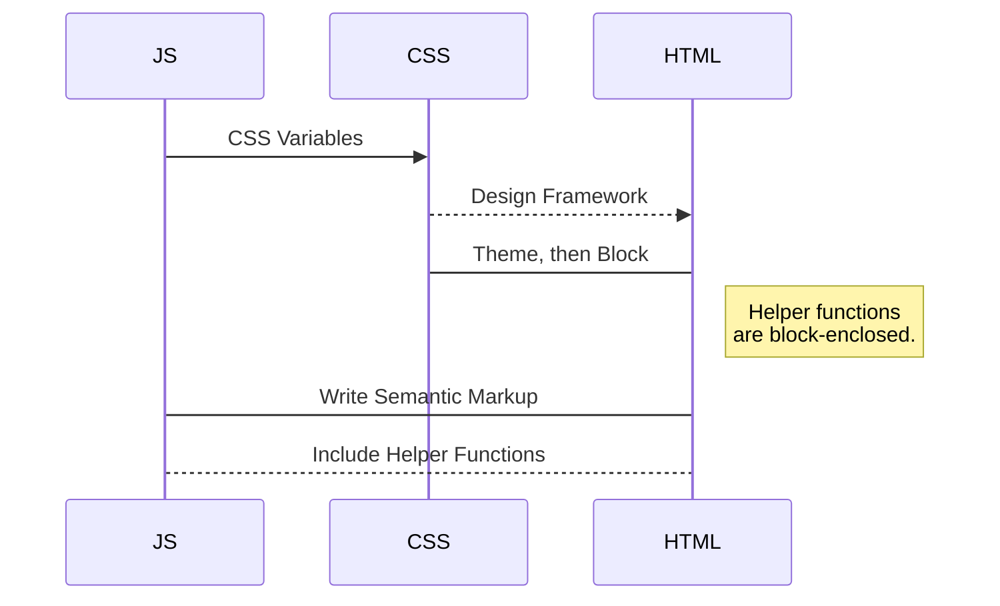

# VanillaBean.js

 

VanillaBean.js is a front-end component library for rendering formatted JSON as PWA-ready DOM elements.

The word "granite" comes from the Latin word, _granum_, meaning grain. A nod to both where it was created (New Hampshire, USA - also known as _The Granite State_), as well as to how it approaches data rendering. Each _block_ of granite.js creates a self-contained chunk of HTML, CSS, and JS that can be late-loaded into any front-end enviroment - yes, even inside your existing Vue, React, or Angular project!

## VanillaBean.js Life Cycle

A block is called via a dynamically-imported JavaScript Promise and is then invoked with a call that includes the required JSON. 
And this will produce a flow chart:

A block is called via a dynamically-imported JavaScript Promise and is then invoked with a call that includes the required JSON. 
And this will produce a flow chart:

# Foundations

The following foundational factors go in to developing and extending Granite.js: 

> **No-Compile Solution:** Granite.js requires one standardized JSON object and generates an immediately usable component, with no need for a compile step between receiving data and rendering results. To this end, we use CSS Variables instead of SASS.

> **A 3-Line Promise:** Granite.js uses ES5 Promises to invoke a UI block, so it should take no more than 3 short lines of code to have a bulletproof rendering solution, whether via CDN or locally. 

> **One Flavor - Vanilla:** Granite.js is based on the best of breed usage of HTML, CSS, and JavaScript. To keep everything as atomic as possible, Granite.js leverages the native strengths of each language or protocol with no special flavors except vanilla. 

> **Chatty vs Chunky Notifications:** From their initial invocation through their entire life cycle, blocks provide interface points for your external notification, warning, and error handling solutions.  

# Core Concepts

The following core concepts constitute the foundation of development of all new and existing _blocks_ of Granite.js 

> **block:** a Granite.js UI element is referred to as a block, and is called via the block(json) format.

> **theme:** Granite.js offers global and/or block-level styling via JSON. In fact, your theme is invoked as a block of its own.

> **dictionary:** This concept is currently under reevaluation.

##  Build Options

You are free to use this project in its raw, uncompressed form by simply copying the files into your structure and following the documented patterns. However, if you are integrating Granite.js into a professional workflow, use the YAML file to build your Development, Stage, and Production environments. This repository's build folder contains the latest pipeline outputs from each of the below's latest run via our own CI/CD automation (that mirrors to GitHub from GitLab).

- **Development**: publish the Markdown text on a website that can interpret it (**GitHub** for instance),
- **Stage**: publish the file converted to HTML via a Handlebars template (on a blog for example).
- **Production**: publish the file converted to HTML via a Handlebars template (on a blog for example).

## Releases

While the Granite.js repository is always available for you to clone and/or compile for your own specific needs, our CI/CD pipeline also builds nightly releases available in the _build_ folder of the root directory here. 

|                |Features                          |Date                         |
|----------------|-------------------------------|-----------------------------|
|Version 0.1.0|Tiles            |May 6, 2020            |
|Version 0.2.0          |Tiles, Tabs            |May 13, 2020           |
|Version 0.3.0          |Tiles, Tabs, Nav, Sidepane|May 20, 2020|
|Version 1.0.0          |Tiles, Tabs, Nav, Sidepane, YAML|May 27, 2020|

## Community

Granite.js is an MIT-licensed open source project with its ongoing development made possible by the support of addapptation and these awesome [backers](https://addapptation.com). If you'd like to join us, please fork this project and reach out to us at granite[at]addapptation[dot]com. 

